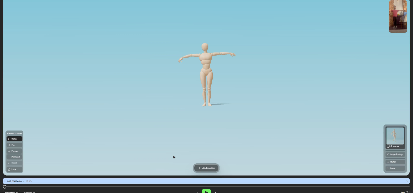

**Cinematics & Low-Budget Mocap** demonstrates how to achieve professional-grade cinematic sequences in Unreal Engine 5 using AI and accessible hardware, bypassing the need for expensive motion capture suits.

The cinematic sequence ("Post Mortem") was orchestrated using a modular **Sequencer Hierarchy** (Master Sequence -> Camera Cuts -> Subsequences). This allowed parallel workflows for character animations and global editing.

Instead of expensive suits, we utilized **Cartwheel** for AI-driven body mocap, tweaking the faulty roots and foot sliding via *Additive Tracks* directly in the timeline. 

  <video src={`${import.meta.env.BASE_URL}/videos/tech-art/a3_cartwheel.mp4`} autoPlay loop muted playsInline style={{ width: '100%', borderRadius: '12px', boxShadow: '0 4px 15px rgba(0,0,0,0.3)' }}></video>
  

    
  

The facial acting was captured in real-time via iPhone using **Live Link Face**, injecting authentic micro-expressions and life into the MetaHumans.

  

    
  

  

    
  

### Final Cinematic Video

  [ Final A3 Video Placeholder ]

---

## Resources

<iframe style={{ border: '1px solid rgba(0, 0, 0, 0.1)', borderRadius: '12px', marginTop: '2rem', width: '100%', height: '450px' }} src="https://www.figma.com/embed?embed_host=share&url=https%3A%2F%2Fwww.figma.com%2Fdeck%2FY8w4tPcqatEeqzEAsafK9Z" allowFullScreen={true}></iframe>

  <a href="https://www.figma.com/deck/Y8w4tPcqatEeqzEAsafK9Z" target="_blank" rel="noopener noreferrer" style={{ fontWeight: 'bold', fontSize: '1.2rem', textDecoration: 'none', color: '#ff5c5c' }}>
    👉 Open the full presentation on Figma
  </a>

