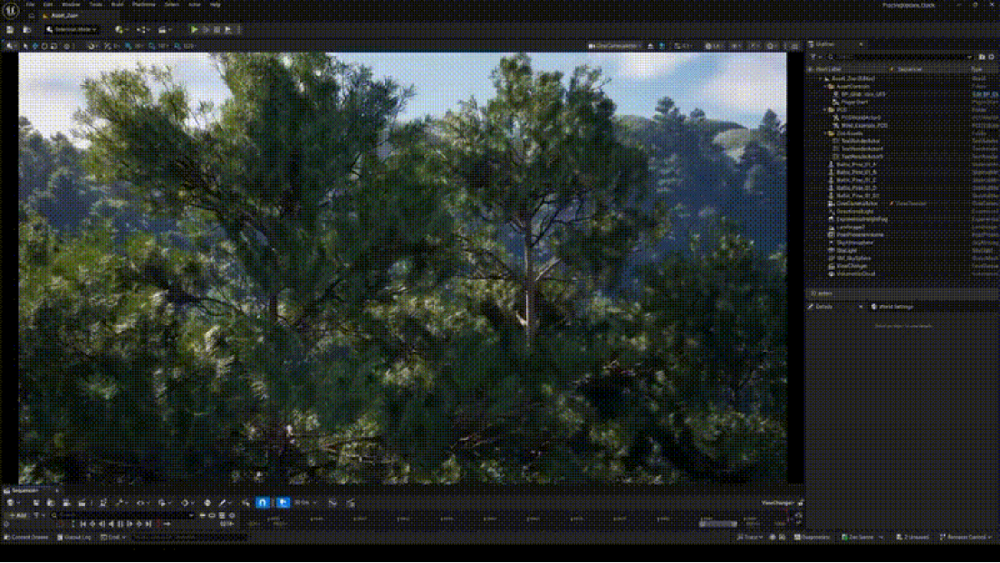

**UE5 Procedural Environments** is a technical exploration demonstrating problem-solving capabilities in Environment Art and non-destructive workflows within Unreal Engine 5. The primary challenge was to create a visual hybrid between the dark fantasy of *The Witcher* and the magical, vibrant aesthetic of *Studio Ghibli*.

### 1. Landscape Auto-Materials & Heightmaps
To build a realistic topography without manual sculpting, we imported a 16-bit Heightmap (generated via Gaea/Motion Forge) directly into the Unreal Engine Landscape Tool. A critical step was correcting the Z-scale proportions to restore the correct height and majesty to the mountains.

Once the landscape geometry was generated, we applied a custom **Auto-Material** based on three core rules:
- **Slope Masks (Z-axis Normals):** Instructs the material to spawn grass on flat surfaces and expose raw rock on steep slopes.
- **Altitude Masks:** A procedural blend that automatically applies snow above a specific Z-height, regardless of the slope.
- **Micro & Macro Variation:** We utilized Noise textures to break the visual repetition (tiling) typical of vast open worlds, maintaining realism from both macro (kilometers away) and micro distances.

### 2. Procedural Ecosystem & PCG
Instead of hand-placing assets, the environment is 100% procedural, allowing the layout to change instantly without manual rework. **Splines govern the Procedural Content Generation (PCG)**—paths, fences, and the garden layout are all derived directly from the geometry rather than being hard-coded.

To overcome the performance limits of traditional billboards, the ecosystem utilizes **Nanite-enabled Megaplants**: photogrammetry-scanned trees with actual geometry for leaves. This eliminates LOD pop-in and allows the **Subsurface Scattering (SSS)** to physically transmit light through the leaves, while the **World Position Offset (WPO)** simulates real-time procedural wind.

  

    <video src={`${import.meta.env.BASE_URL}/videos/tech-art/a1_pcg.mp4`} autoPlay loop muted playsInline style={{ width: '100%', borderRadius: '12px', boxShadow: '0 4px 15px rgba(0,0,0,0.3)' }}></video>
  

  

    <video src={`${import.meta.env.BASE_URL}/videos/tech-art/env_a1.mp4`} autoPlay loop muted playsInline style={{ width: '100%', borderRadius: '12px', boxShadow: '0 4px 15px rgba(0,0,0,0.3)' }}></video>
  

  

    
  

### 3. Dynamic Day/Night Cycle
The lighting is managed by the **Celestial Night** system, a unified ecosystem controlled by a single "time" variable. It physically calculates the position of the sun, moon phases, and stars natively, driving the *Exponential Height Fog* and *Volumetric Clouds* to generate dynamic God Rays. 

Crucially, the global color temperature (PBR) is recalculated in real-time for fluid transitions from dawn to dusk. To handle artificial lighting, we engineered a custom **Switching Lights Blueprint**: it listens to the time variable and uses a "Tag" system to procedurally turn on the level's streetlights when the sun sets.

### Technical Roadblocks
Developing this ecosystem came with heavy technical hurdles. Enabling Nanite on the Landscape initially caused severe framerate drops and continuous engine crashes. Integrating the Megaplants required a vastly different PCG instantiation logic compared to standard meshes, and configuring the atmospheric *Mie Scattering* accidentally caused a visual bug that looked like snow.

---

## Resources

<iframe style={{ border: '1px solid rgba(0, 0, 0, 0.1)', borderRadius: '12px', marginTop: '2rem', width: '100%', height: '450px' }} src="https://www.figma.com/embed?embed_host=share&url=https%3A%2F%2Fwww.figma.com%2Fdeck%2FY8w4tPcqatEeqzEAsafK9Z" allowFullScreen={true}></iframe>

  <a href="https://www.figma.com/deck/Y8w4tPcqatEeqzEAsafK9Z" target="_blank" rel="noopener noreferrer" style={{ fontWeight: 'bold', fontSize: '1.2rem', textDecoration: 'none', color: '#ff5c5c' }}>
    👉 Open the full presentation on Figma
  </a>

