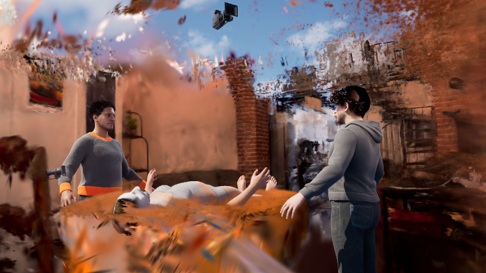
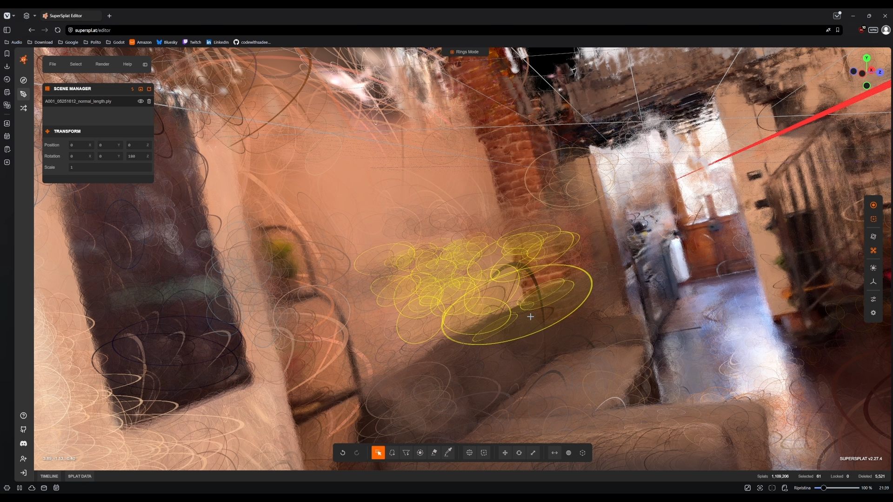

**Reality Capture vs Gaussian Splatting** is an exploration of extracting high-fidelity 3D data from 2D videos, comparing traditional photogrammetry with modern neural rendering techniques.

Extracting 3D data from video required strict photographic rules. Our "golden rules" for photogrammetry were: 
* **No Stabilization**: the camera must be "pure" to avoid confusing the algorithms.
* **Chest Height**: camera facing forward to maintain a constant perspective.
* **Crab Walk**: moving around the perimeter of the room first, followed by three slow 360° pans from the center.

  

    <video src={`${import.meta.env.BASE_URL}/videos/tech-art/a4_house.mp4`} autoPlay loop muted playsInline style={{ width: '100%', borderRadius: '12px', boxShadow: '0 4px 15px rgba(0,0,0,0.3)' }}></video>
  

  

    Processing 4500 frames through **COLMAP** locally led to a 10-hour failure due to non-convergent algorithms. We bypassed this by scripting an *FFmpeg* batch to sample frames (1 out of 7), and running COLMAP via CLI.
  

We then compared **NeRF** (which suffered from "melted wax" artifacts and floaters) against **Gaussian Splatting**. The local *XScene* gaussian generation proved noisy and time-consuming (4h for bad results), while AI cloud tools like *Luma* and *Vid2Scene* delivered cleaner Point Clouds out-of-the-box.

  

    
  

  

    
  

---

## Resources

<iframe style={{ border: '1px solid rgba(0, 0, 0, 0.1)', borderRadius: '12px', marginTop: '2rem', width: '100%', height: '450px' }} src="https://www.figma.com/embed?embed_host=share&url=https%3A%2F%2Fwww.figma.com%2Fdeck%2FY8w4tPcqatEeqzEAsafK9Z" allowFullScreen={true}></iframe>

  <a href="https://www.figma.com/deck/Y8w4tPcqatEeqzEAsafK9Z" target="_blank" rel="noopener noreferrer" style={{ fontWeight: 'bold', fontSize: '1.2rem', textDecoration: 'none', color: '#ff5c5c' }}>
    👉 Open the full presentation on Figma
  </a>

