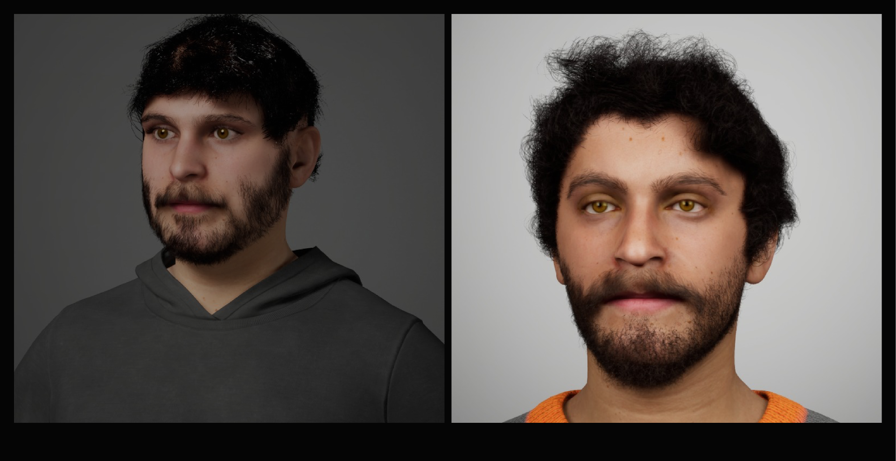
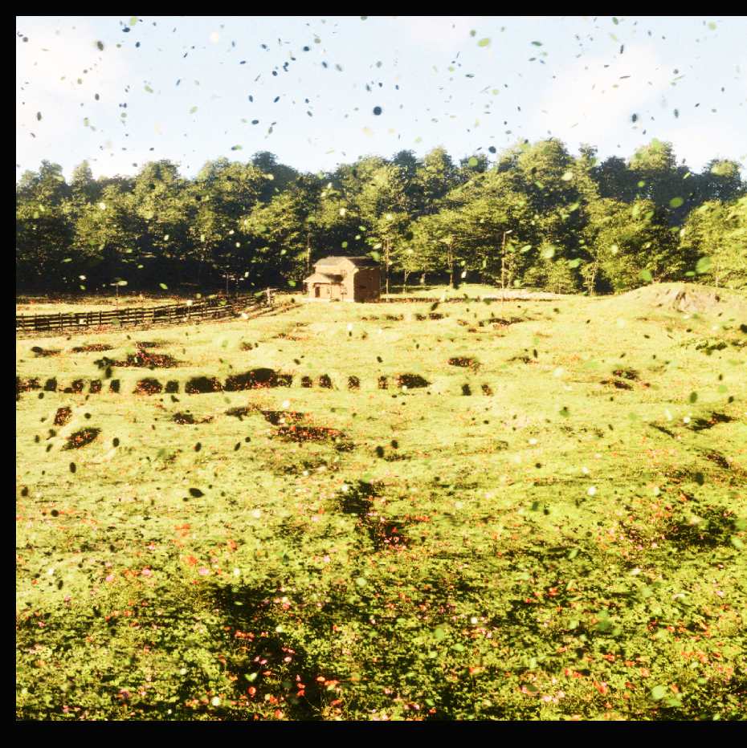
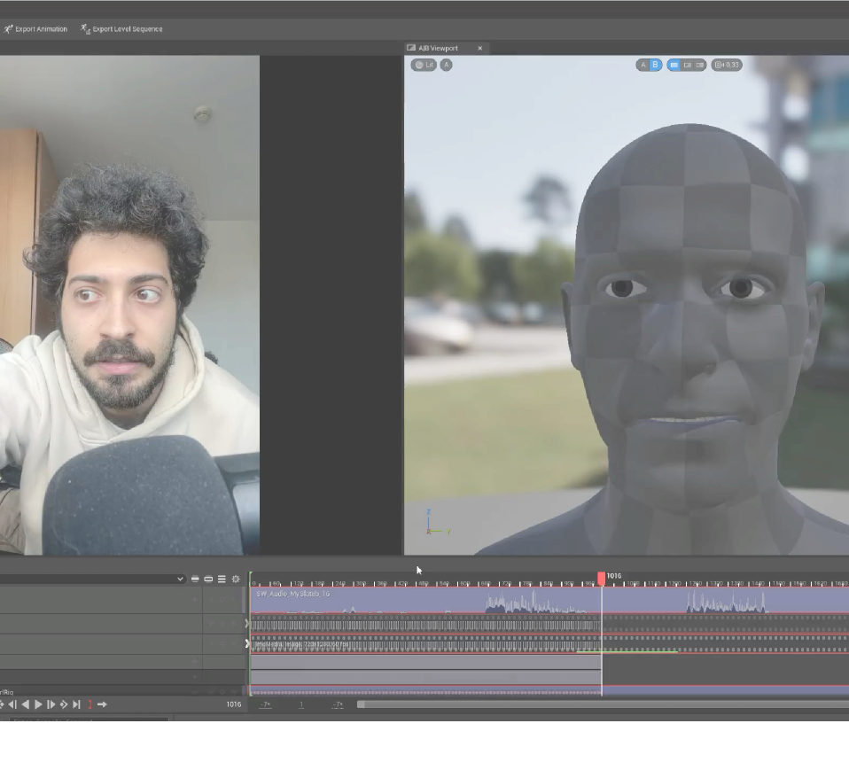
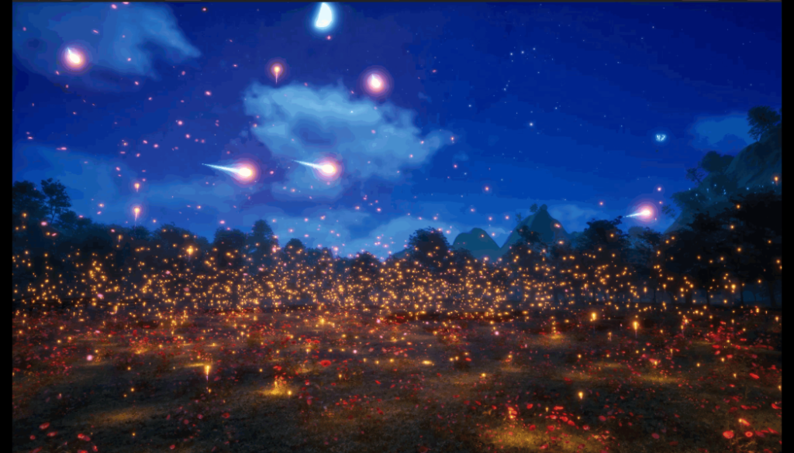

**UE5 Tech Art Showcase** is an extensive technical exploration inside Unreal Engine 5, demonstrating problem-solving capabilities across Environment Art, Character pipelines, Cinematics, Reality Capture, and Niagara VFX.

---

## 1. Environment Art & Procedural Workflows

Instead of hand-placing assets, the environment relies heavily on **Procedural Content Generation (PCG)**. Splines govern the generation of paths and fences, creating a non-destructive pipeline where the layout can change instantly without manual rework.

  

    <video src={`${import.meta.env.BASE_URL}/videos/tech-art/a1_pcg.mp4`} autoPlay loop muted playsInline style={{ width: '100%', borderRadius: '12px', boxShadow: '0 4px 15px rgba(0,0,0,0.3)' }}></video>
  

  

    <video src={`${import.meta.env.BASE_URL}/videos/tech-art/env_a1.mp4`} autoPlay loop muted playsInline style={{ width: '100%', borderRadius: '12px', boxShadow: '0 4px 15px rgba(0,0,0,0.3)' }}></video>
  

Using a custom **Landscape Auto-Material**, rock and grass are blended automatically based on the Z-axis (slope normal) and altitude masks. To overcome the performance limits of traditional billboards, the environment utilizes **Nanite-enabled Megaplants**: photogrammetry-scanned trees with actual geometry for leaves. This eliminates LOD pop-in and allows the **Subsurface Scattering (SSS)** to physically transmit light through the leaves, while the **World Position Offset (WPO)** simulates real-time procedural wind.

  

    
  

---

## 2. MetaHumans: Defeating the Uncanny Valley

The initial attempt to import a custom sculpted face via FaceBuilder and Alembic to MetaHuman failed critically: the **Groom Binding broke**, causing the hair to detach and explode during facial animations. 

  

    
  

  

    We experienced heavy physics glitches and clipping during early grooming attempts. The hair curves lacked structural integrity in the simulation.
  

  

    <video src={`${import.meta.env.BASE_URL}/videos/tech-art/a2_hair.mp4`} autoPlay loop muted playsInline style={{ width: '100%', borderRadius: '12px', boxShadow: '0 4px 15px rgba(0,0,0,0.3)' }}></video>
  

  

    <video src={`${import.meta.env.BASE_URL}/videos/tech-art/a2_hair_2.mp4`} autoPlay loop muted playsInline style={{ width: '100%', borderRadius: '12px', boxShadow: '0 4px 15px rgba(0,0,0,0.3)' }}></video>
  

The successful pivot involved using **Reality Scan** combined with the *Mesh to MetaHuman* plugin. This allowed for an accurate topological fit while perfectly preserving the complex rigging, skin shaders, and groom components that make MetaHumans photorealistic.

---

## 3. Cinematics & Low-Budget Mocap

The cinematic sequence ("Post Mortem") was orchestrated using a modular **Sequencer Hierarchy** (Master Sequence -> Camera Cuts -> Subsequences). This allowed parallel workflows for character animations and global editing.

Instead of expensive suits, we utilized **Cartwheel** for AI-driven body mocap, tweaking the faulty roots and foot sliding via *Additive Tracks* directly in the timeline. 

  

    <video src={`${import.meta.env.BASE_URL}/videos/tech-art/a3_cartwheel.mp4`} autoPlay loop muted playsInline style={{ width: '100%', borderRadius: '12px', boxShadow: '0 4px 15px rgba(0,0,0,0.3)' }}></video>
  

  

    
  

The facial acting was captured in real-time via iPhone using **Live Link Face**, injecting authentic micro-expressions and life into the MetaHumans.

  

    
  

  

    
  

---

## 4. Reality Capture vs Gaussians

Extracting 3D data from video required strict photographic rules. Our "golden rules" for photogrammetry were: 
* **No Stabilization**: the camera must be "pure" to avoid confusing the algorithms.
* **Chest Height**: camera facing forward to maintain a constant perspective.
* **Crab Walk**: moving around the perimeter of the room first, followed by three slow 360° pans from the center.

  

    <video src={`${import.meta.env.BASE_URL}/videos/tech-art/a4_house.mp4`} autoPlay loop muted playsInline style={{ width: '100%', borderRadius: '12px', boxShadow: '0 4px 15px rgba(0,0,0,0.3)' }}></video>
  

  

    Processing 4500 frames through **COLMAP** locally led to a 10-hour failure due to non-convergent algorithms. We bypassed this by scripting an *FFmpeg* batch to sample frames (1 out of 7), and running COLMAP via CLI.
  

We then compared **NeRF** (which suffered from "melted wax" artifacts and floaters) against **Gaussian Splatting**. The local *XScene* gaussian generation proved noisy and time-consuming (4h for bad results), while AI cloud tools like *Luma* and *Vid2Scene* delivered cleaner Point Clouds out-of-the-box.

  

    
  

  

    
  

---

## 5. Niagara VFX: The Magic Comet

To bring a magical feel to the environment, a complex **Niagara System** was engineered. It features a Main Emitter for the core, a Trail Ribbon for the tail, and physics-enabled Sparks upon impact.

  

    The magic lies in the **Blueprint Logic**: the target's World Location is injected into the Niagara System dynamically every frame. The *Point Attraction Force* module reads this parameter, bending the comet's trajectory mid-air to hunt down the target. Modifying the "Strand Size" on the hair groom prevented the mesh from clipping or exploding upon collision with the magic particles.
  

  

    
  

### Final Result Export

  <video src={`${import.meta.env.BASE_URL}/videos/tech-art/a5_final.mp4`} autoPlay loop muted playsInline style={{ width: '100%', borderRadius: '12px', boxShadow: '0 4px 15px rgba(0,0,0,0.3)' }}></video>

---

## Resources
[👉 **View the full Figma Presentation**](https://www.figma.com/file/placeholder-link)
